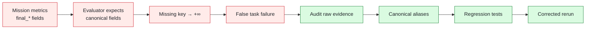

# Experiment Integrity Incidents and Corrections

This document records experiment-integrity problems that changed or could have changed reported conclusions.

## Incident I-001 — Metric schema mismatch in Phase 1.2b

### Detected by

Manual consistency check before entering Phase 1.3.

### Symptom

Two claims could not both be true under the same frozen task envelope:

- last reliable distance: 4.53125 m;
- direct 4.0 m: reported FAIL with drift -0.281 m and heading -6.72°.

The Phase 1.2 nominal lateral threshold at 4 m was 0.35 m and heading threshold 15°.

### Investigation

Raw evidence was independently recomputed for:

- direct 4.0 m;
- boundary 4.53125 m;
- boundary 4.625 m.

The direct 4 m metrics were inside the nominal envelope.

### Root cause

Segmentation missions used keys:

- `final_lateral_drift_m`;
- `final_heading_error_deg`;
- `final_forward_progress_m`.

The shared evaluator expected canonical:

- `lateral_drift_m`;
- `heading_error_deg`;
- `forward_displacement_m`.

Missing fields silently defaulted to positive infinity.

### Impact

The original claim that all 12 segmentation-comparison missions failed was incorrect.

The open-loop distance boundary itself was unaffected because that campaign already emitted canonical fields.

### Corrective action

1. Preserve original pre-audit raw evidence.
2. Add canonical aliases.
3. Make comparison aggregation alias-safe.
4. Add six regression tests.
5. Rerun affected mission evaluations.
6. Publish a correction rather than overwriting history.
7. In Phase 1.3, introduce canonical typed `RunMetrics`.
8. Missing/non-finite required metrics now raise `MissingMetricError` instead of silently becoming infinity.

### Corrected result

- direct 4 m: PASS;
- segmented 4 m: FAIL;
- direct 6/8 m: FAIL;
- segmented 6/8 m: worse;
- open-loop boundary remains 4.53125–4.625 m.

### Integrity lesson

> A shared evaluator is not actually shared if different campaigns feed it different schemas.

---

## Incident-prevention rules introduced afterward

### Canonical metrics

Every reportable execution path must canonicalize metrics before evaluation.

### Fail loudly

Required metrics cannot use permissive fallback values.

### Raw evidence preservation

Corrections do not delete or rewrite the original raw evidence.

### Audit trail

A correction must state:

- original conclusion;
- detected issue;
- affected outputs;
- corrected conclusion;
- unaffected evidence.

### Protocol freeze

Thresholds and task envelopes cannot be changed after final data is seen.

### Separation of pilot and final

Pilot results may influence the frozen protocol; final results may not.

### Deterministic repetition labelling

Repeated deterministic trajectories are not represented as independent random samples.

### Physical vs task success

These remain separate fields at every layer.

---

## Local/remote integrity limitation

The Phase 1–2.1 implementation branches are currently local-only and therefore cannot yet be independently fetched from GitHub.

The local reports include commit SHAs and protocol hashes, but remote reproducibility requires those branches to be pushed.

This notebook intentionally records that limitation instead of implying the remote repository already contains all experiment evidence.
