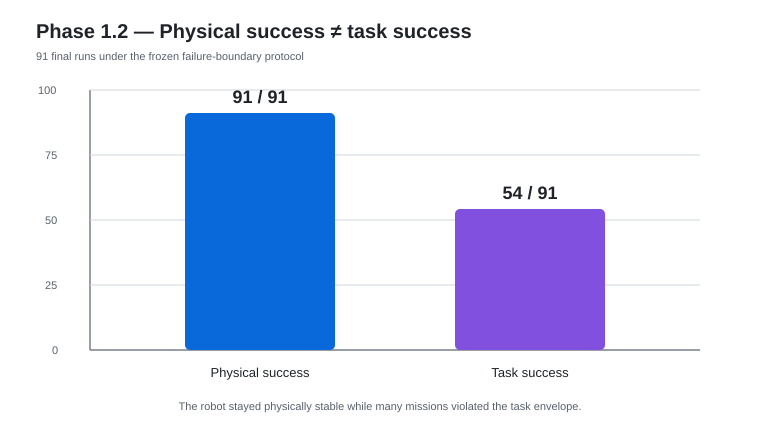
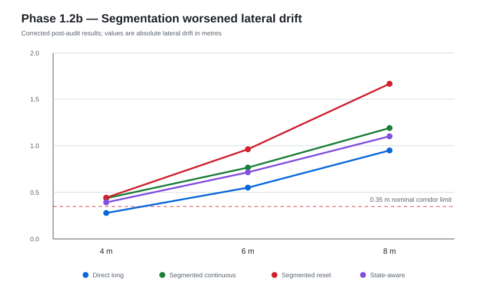
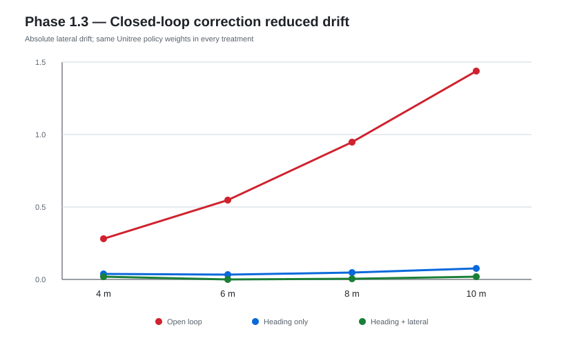

# Phase 1 — Embodied Execution Layer

This entry records the full reasoning path from “G1 can be loaded in MuJoCo” to “G1 can execute long-distance locomotion with a validated closed-loop task envelope.”

## Phase 1 — Simulation baseline

### Question

Can a credible Unitree G1 model run on the current Windows machine, and can we build a real skill contract without inventing motion?

### Baseline

Local branch: `phase1/g1-simulation-baseline`  
HEAD: `217fc71`

Environment:

- Windows 11
- Python 3.11.9
- MuJoCo 3.15.0
- torch 2.14.1+cu130
- CUDA 13.0
- RTX 5060 Ti 16 GB

### Difficulty

A direct PD standing attempt fell after approximately 1.29 s.

That was important because the easy but invalid response would have been to fake stability, modify root pose directly, or quietly weaken the task.

### Reasoning

The project rule was:

> Prefer a credible official controller or report BLOCKED; never manufacture a locomotion result.

### Solution

Use official Unitree assets:

- `unitreerobotics/unitree_mujoco` for the full G1 model;
- `unitreerobotics/unitree_rl_gym` for locomotion assets;
- official pretrained `motion.pt` for the 12-DoF leg policy.

Build:

- `G1Simulation`;
- `RobotState`;
- typed Skill / SkillResult / SkillStatus;
- Stand / Stop / WalkForward / Turn;
- evidence manifests and metrics.

### Result

Baseline-001:

```text
Stand
→ WalkForward(2m)
→ Stop
```

passed 5 deterministic runs.

Important measurements:

- mean displacement 2.169 m;
- lateral drift -0.365 m;
- heading error -8.41°;
- falls 0.

### What this did not prove

- robustness;
- independent-seed generalization;
- 29-DoF whole-body control;
- manipulation;
- sim-to-real.

### Decision

The clear systematic path error motivated competence characterization instead of immediate task-layer development.

---

## Phase 1.1 — Competence characterization

### Question

Where is each current skill reliable, and how do errors change with distance, duration, speed, and perturbation?

### Difficulty

Phase 1's multiple seeds produced identical trajectories. Repeating the same deterministic trajectory five times was not evidence of robustness.

### Reasoning

Make the world genuinely different under different seeds before discussing variance.

### Intervention

Characterize:

- WalkForward 0.5/1/2/3/5 m;
- Turn ±30/±45/±60/±90°;
- Stand 5/10/20 s;
- Stop from multiple speeds;
- yaw, position, joint, friction, and push perturbations.

### Key result

All 237 final runs stayed within the then-frozen success envelope.

But the continuous metrics exposed clear degradation:

| Distance | Lateral drift | Heading error |
| ---: | ---: | ---: |
| 0.5 m | -0.159 m | -4.4° |
| 2 m | -0.290 m | -6.5° |
| 5 m | -0.707 m | -10.7° |

Stand stayed upright while drifting ~0.447 m over 20 s.

### Difficulty discovered

The tested envelope was not harsh enough to find failure.

### Breakthrough

Generated a machine-readable competence profile instead of a binary “robot works” statement.

### Decision

Actively search for failure boundaries.

---

## Phase 1.2 — Failure boundary and skill risk

### Question

When does the current controller stop being task-reliable even if the robot remains physically stable?

### Key conceptual change

Separate:

```text
physical_success
task_success
```

A robot walking 10 m while drifting two metres sideways is physically successful and task-failed.

### Experiment design

Freeze a warehouse-corridor proxy and search one variable at a time.

### Results

91/91 final runs were physical successes.

Only 54/91 were task successes.



This was the point where the project stopped treating “did not fall” as equivalent to “completed the task.”

Representative failures:

- 10 m walk: drift -1.440 m, heading -15.09°;
- friction 0.15: drift -2.041 m, heading -49.90°;
- 20° initial yaw: world-frame drift +0.590 m;
- push 60 N: only 2/5 task successes in final sampling.

### Important lesson

Two-seed exploratory sampling temporarily misclassified the 60 N push point as reliable. Five-seed final sampling showed only 40% task success.

This justified the pilot/frozen/final separation.

### Breakthrough

Produced:

- capability-boundary evidence;
- deterministic risk labels;
- explicit UNKNOWN when a boundary was not reached.

---

## Phase 1.2b — Segmentation hypothesis

### Hypothesis

If long WalkForward commands accumulate drift, perhaps a long task can be made safer by splitting it into repeated short, individually low-risk segments.

### Treatments

- direct long skill;
- segmented with continuous controller memory;
- segmented with standard memory reset;
- state-aware remaining-distance variant.

### Important confound discovered

Walk / Stand / Turn reset the controller's recurrent memory, while Stop does not.

Therefore, “segmentation” could not be interpreted without separating recurrent-memory reset.

### Initial apparent result

The first report claimed all 4/6/8 m missions failed.

That result contained an inconsistency and triggered an audit.

---

## Phase 1.2b Audit — The evaluator bug

### Symptom

The report said:

- 4.53125 m was reliable;
- 4.625 m was first failure;

but also:

- direct 4 m was FAIL with drift -0.281 m and heading -6.72°.

Under the nominal envelope, 4 m should have passed.

### Root cause

Mission metrics emitted:

- `final_lateral_drift_m`
- `final_heading_error_deg`
- `final_forward_progress_m`

The shared evaluator expected:

- `lateral_drift_m`
- `heading_error_deg`
- `forward_displacement_m`

Missing keys silently fell back to `+inf`.

The evaluator therefore manufactured `EXCESSIVE_DRIFT` and `HEADING_ERROR` failures.

### Solution

- add canonical metric aliases;
- make aggregation alias-safe;
- preserve pre-audit evidence;
- add regression tests;
- rerun affected mission evaluation;
- later replace silent missing-value fallback with strict `RunMetrics.validate()`.

### Corrected segmentation result

| Distance | Direct | Segmented |
| ---: | --- | --- |
| 4 m | PASS, -0.281 m drift | all variants FAIL, -0.393 to -0.445 m |
| 6 m | FAIL, -0.549 m | all worse |
| 8 m | FAIL, -0.947 m | all worse |

Open-loop boundary remained:

- last reliable 4.53125 m;
- first failure 4.625 m.

### Research conclusion



The segmentation hypothesis failed.

In fact, segmentation could convert an already successful 4 m task into a failure.

The memory-reset treatment was worst, showing that controller memory is part of sequence state.

### Breakthrough

The project gained an integrity lesson more valuable than a positive result:

> A sequence of individually low-risk skills is not automatically a low-risk mission.

---

## Phase 1.3 — Closed-loop locomotion correction

### Question

Is long-distance failure primarily caused by the absence of outer-loop path feedback rather than insufficient motor skill?

### Hypothesis

A small heading/lateral feedback correction applied to high-level command input should reduce accumulated path error without retraining the Unitree policy.

### Frozen variables

Unchanged:

- `motion.pt`;
- policy weights;
- PD gains;
- action scale;
- task envelope;
- G1 model.

### Treatments

1. open-loop;
2. heading-only;
3. heading + lateral.

### Pilot

Heading gain candidates: 0.5 / 1.0 / 1.5.

All corrected 8 m successfully; `k_heading=1.5` gave the smallest residual.

Lateral candidates: 0.5 / 1.0 / 2.0.

`k_lateral=1.0` was frozen before final evaluation.

### Final result



| Distance | Open-loop | Heading only | Heading + lateral |
| ---: | --- | --- | --- |
| 4 m | PASS | PASS | PASS |
| 6 m | FAIL | PASS | PASS |
| 8 m | FAIL | PASS | PASS |
| 10 m | FAIL | PASS | PASS |

At 10 m:

- open: -1.440 m drift, -15.09°;
- heading-only: -0.077 m, -1.00°;
- heading+lateral: -0.019 m, -0.58°.

Correction RMS was only ~0.02 rad/s.

There were:

- 0 saturation events;
- 0 measured oscillations;
- no physical stability regression;
- no meaningful time penalty.

Reliable corrected distance was at least 20 m within the frozen search budget.

### Difficult condition

At friction 0.175:

- open-loop: -4.426 m drift / -71.38°, FAIL;
- heading+lateral: -0.009 m / -0.42°, PASS.

### Breakthrough

The validated task range grew from ~4.6 m to at least 20 m without replacing or retraining the underlying locomotion policy.

### What we cannot claim

- the true corrected failure boundary is 20 m;
- real-world robustness;
- arbitrary terrain generalization;
- recovery ability;
- manipulation capability.

### Decision

The embodied execution layer became sufficiently reliable to stop optimizing locomotion and move to mission-level research.
