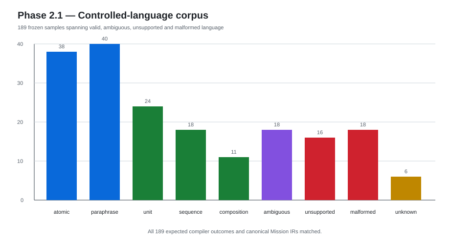

# Phase 2 — Mission Runtime and Language

Phase 2 moved the project from “a robot with validated skills” to “a robot that can execute structured missions and receive bounded language commands.”

## Phase 2.0 — Oracle structured mission runtime

### Question

If user intent is already perfectly represented as structured data, can a deterministic runtime execute multi-step missions safely and reproducibly?

### Why this experiment came first

Introducing language before establishing an Oracle runtime would mix:

- language-understanding errors;
- capability-selection errors;
- task-graph errors;
- robot execution errors.

The Oracle path isolates the latter three.

### Design

Pipeline:

```text
Mission IR
→ Validator
→ Capability Grounder
→ Task Graph
→ Mission Executor
→ Skill Router
→ G1
```

Supported skills were deliberately limited to validated capabilities:

- stand;
- stop;
- walk_forward;
- turn.

No recovery, replanning, manipulation, perception, or natural language was allowed.

### Capability grounding

The Runtime reads Phase 1 evidence rather than hard-coding claims.

For walking, it can distinguish execution modes such as:

- open-loop;
- heading-only;
- heading+lateral.

Unknown evidence is treated as UNKNOWN rather than extrapolated.

### Difficulty

A mission runtime can easily become a disguised planner if it silently retries, segments, replans, or “helps.”

### Solution

Keep Phase 2.0 deliberately dumb:

- deterministic;
- no retry;
- no recovery;
- no replanning;
- node failure blocks descendants;
- rejected missions execute zero simulation steps.

### Result

Frozen benchmark:

| Horizon | Missions | Success |
| --- | ---: | ---: |
| H1 | 5 | 5 |
| H3 | 5 | 5 |
| H5 | 5 | 5 |
| H8 | 5 | 5 |

Additional facts:

- 20/20 valid missions succeeded;
- 15/15 negative missions were rejected;
- every rejected mission executed 0 simulation steps;
- 85 skill invocations;
- 65 skill transitions;
- 236,698 simulation steps;
- 185 tests passed.

### Negative finding

No horizon degradation appeared in this small deterministic corpus.

This is not evidence of a scaling law or open-world long-horizon reliability. It only establishes a working Oracle baseline.

### Breakthrough

The project now had a canonical Mission IR and a deterministic mission execution layer that later language / Jev / multi-swarm systems can be compared against.

---

## Phase 2.1 — Controlled Chinese language compiler

### Question

Can bounded Chinese natural language be compiled deterministically into the exact same Mission IR without weakening the runtime safety boundary?

### Why use a grammar baseline

Before evaluating an LLM, the project needed a strong non-generative reference that is:

- deterministic;
- explainable;
- fast;
- fail-closed;
- easy to audit.

### Technology

`lark==1.3.1`

Configuration:

- LALR parser;
- contextual lexer;
- typed Transformer;
- deterministic normalization.

### Supported language

Controlled expressions for:

- stand;
- stop;
- walk forward by explicit distance;
- turn left/right by explicit angle;
- bounded command sequencing.

Supported normalization included Chinese/Arabic numbers and metres/centimetres/degrees.

### Safety principle

> No silent guessing.

Examples:

- “往前走一点” → ambiguity, not a guessed distance;
- “右转” → missing parameter;
- “拿杯子” → unsupported;
- “前进25米” → language compiler SUCCESS, later capability UNKNOWN.

That final case was important: capability boundaries remained the Runtime's responsibility, not the language parser's.

### Corpus

Frozen total: 189 samples.

Breakdown included:

- atomic valid;
- paraphrases;
- unit variants;
- sequence variants;
- compositions;
- ambiguous;
- unsupported;
- malformed;
- capability unknown.

### Result



- 189/189 compiler status and canonical Mission IR matched expectation;
- exact valid IR match: 100%;
- paraphrase consistency: 100%;
- ambiguity recall: 100%;
- unsupported recall: 100%;
- false rejection: 0;
- hallucinated skill count: 0;
- invalid/ambiguous/unsupported language reaching robot: 0;
- average compiler latency ~58 µs;
- 11/11 representative language missions matched Oracle IR and Runtime behavior;
- 361 tests passed.

### Difficulty and limitation

Unsupported detection still depends on a finite unsupported-keyword lexicon. Unseen unsupported phrasing may fail closed as generic malformed language rather than receive a friendly unsupported label.

Chinese-number conversion is intentionally bounded.

The grammar does not claim unrestricted natural-language understanding.

### Breakthrough

Phase 2.1 established a strong deterministic language baseline.

This makes the next experiment scientifically meaningful:

```text
same Mission IR
same Validator
same Grounder
same Runtime
same G1
different compiler only

Lark
vs
LLM
```

---

## Current Phase 2.2 question

The next experiment should measure a trade-off, not celebrate LLM usage:

> How much open-language coverage does an LLM add over the frozen grammar baseline, and what does that gain cost in wrong IRs, unsafe acceptance, over-refusal, latency, variability, and API/token usage?

The runtime safety boundary remains frozen.
