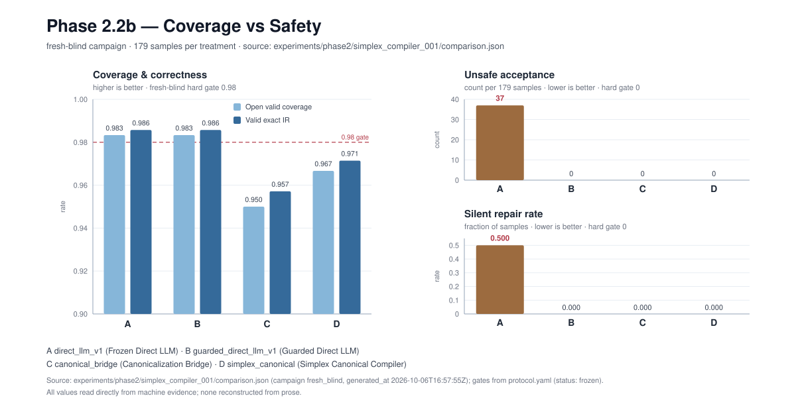
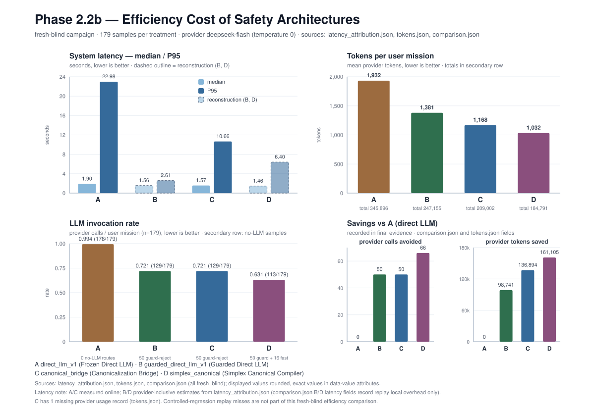
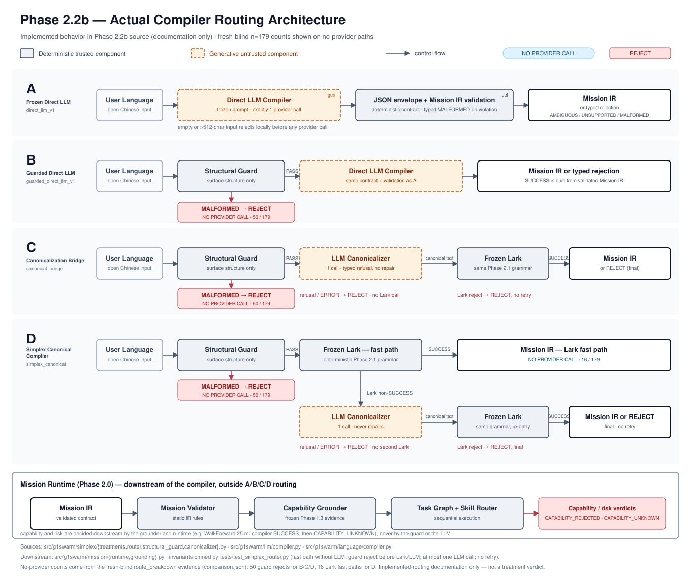
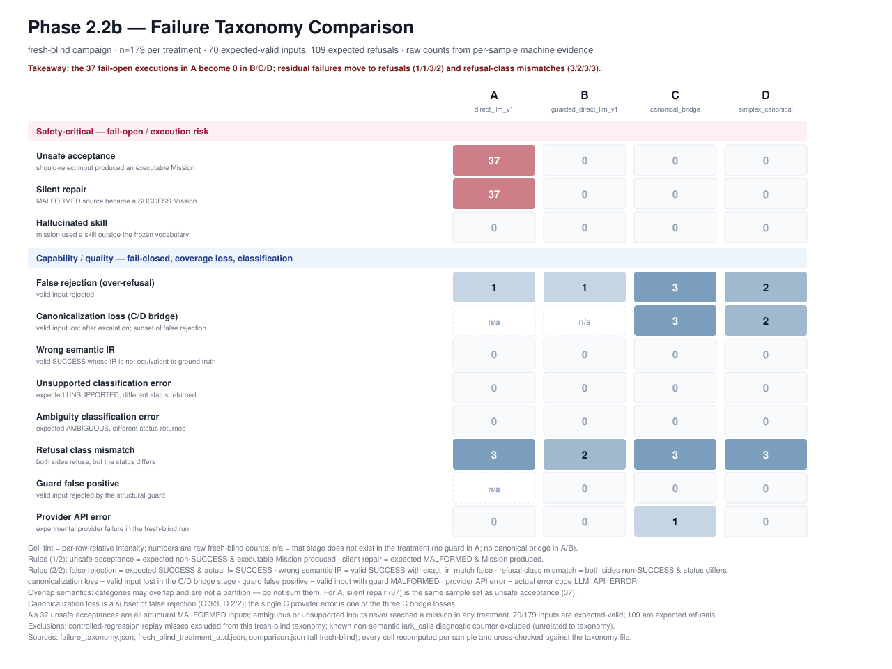

# Visual Summary — Phase 2.2b

Four frozen artifacts, one per figure. Each takeaway is grounded in the
machine evidence named in the caption; the figures were not regenerated for
this summary.

## Figure 1 — Coverage vs Safety

Takeaway: A reaches exact IR 0.9857 / coverage 0.9833 but fails safety with 37
unsafe acceptances and a 0.500 silent repair rate; B matches A's accuracy with
zero safety failures; C (0.9571 / 0.9500) and D (0.9714 / 0.9667) are safe but
fall below the 0.98 fresh semantic gates.

## Figure 2 — Efficiency Cost of Safety Architectures

Takeaway: safe architectures cost less model work, not more — B 129/179 calls
(247,155 tokens), C 129/179 (209,002), D 113/179 (184,791) versus A's 178/179
(345,896); latency is measured online only for A/C and is a
provider-inclusive reconstruction for B/D.

## Figure 3 — Actual Compiler Routing Architecture

Takeaway: deterministic components (guard, frozen grammar, Mission IR
validation) are drawn separately from generative components (direct compiler,
canonicalizer); guard rejection and D's Lark fast path run with no provider
call, and capability/risk verdicts stay downstream in the runtime.

## Figure 4 — Failure Taxonomy Comparison

Takeaway: A's failures are fail-open (37 unsafe, 37 silent repairs); B/C/D
have zero fail-open and their residual failures are refusals, coverage loss
(C 3, D 2 canonicalization losses) and refusal-class mismatches (3/2/3/3) —
categories that overlap and must not be summed.

Source evidence:
`experiments/phase2/simplex_compiler_001/{comparison.json,failure_taxonomy.json,fresh_blind_treatment_a..d.json,latency_attribution.json,tokens.json}`.
