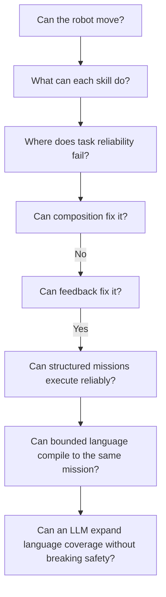
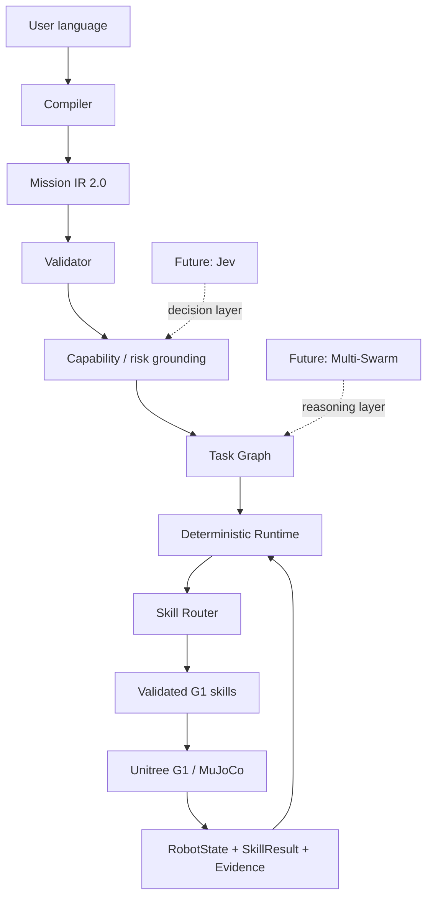

# Visual Research Summary

This page is the visual entry point for the experiment record. Every chart below is reconstructed from the frozen experiment reports already recorded in this notebook. It does not replace the underlying evidence.

## Research progression

The key methodological transition was:

## Physical stability was not task success

**Takeaway:** Phase 1.2 produced 91/91 physically stable runs but only 54/91 task successes. This forced the project to separate robot health from task correctness.

## Segmentation was a negative result

**Takeaway:** splitting long walks into short ones did not reduce drift. At 4 m, direct execution passed while every segmented treatment failed after the audit correction.

## Closed-loop feedback changed the capability envelope

**Takeaway:** with the Unitree policy weights unchanged, heading or heading+lateral feedback converted 6/8/10 m failures into passes and pushed the validated reliable distance to at least 20 m within the frozen budget.

## Controlled-language benchmark coverage

**Takeaway:** Phase 2.1 tested 189 frozen samples across valid, compositional, ambiguous, unsupported, malformed and capability-unknown language. Every expected compiler result and canonical Mission IR matched.

## Integrity correction chain

```mermaid
flowchart LR
    A["Segmentation run emits<br/>final_lateral_drift_m"] --> B["Shared evaluator expects<br/>lateral_drift_m"]
    B --> C["Missing key became +∞"]
    C --> D["False EXCESSIVE_DRIFT"]
    D --> E["4 m direct incorrectly marked FAIL"]
    E --> F["Manual inconsistency check"]
    F --> G["Raw evidence recomputed"]
    G --> H["Canonical metric aliases + regression tests"]
    H --> I["Affected runs re-evaluated"]
    I --> J["Corrected conclusion:<br/>4 m direct PASS;<br/>segmentation still worse"]

    classDef bad fill:#ffebe9,stroke:#cf222e,color:#1f2328;
    classDef fix fill:#dafbe1,stroke:#1a7f37,color:#1f2328;
    class A,B,C,D,E bad;
    class F,G,H,I,J fix;
```

## Current architecture boundary

The future Jev and multi-swarm layers are intentionally shown as dotted, because their value has not yet been experimentally established.
