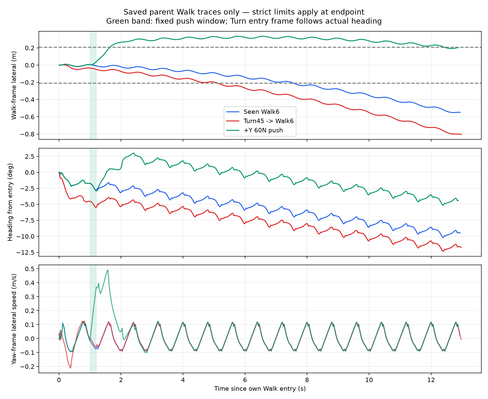
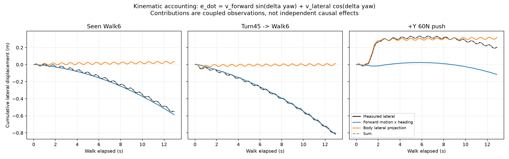
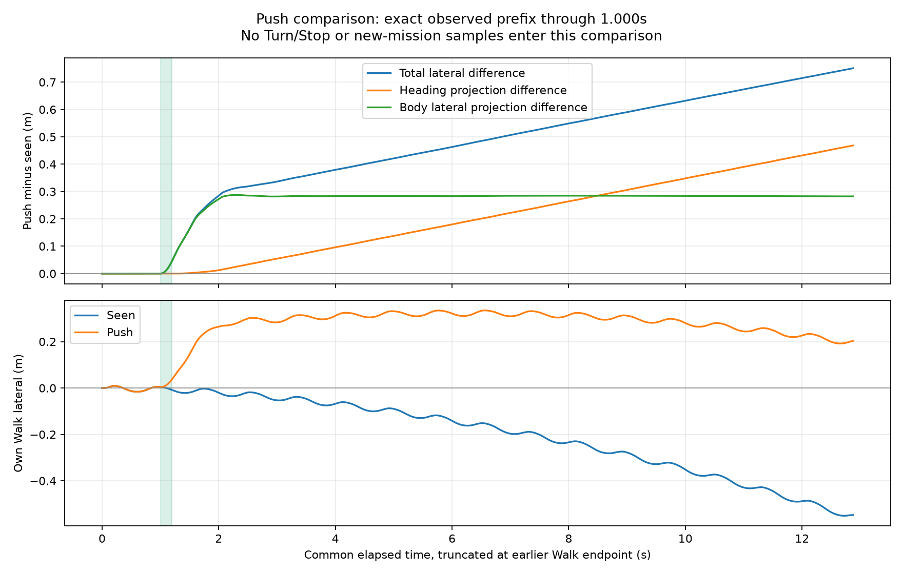
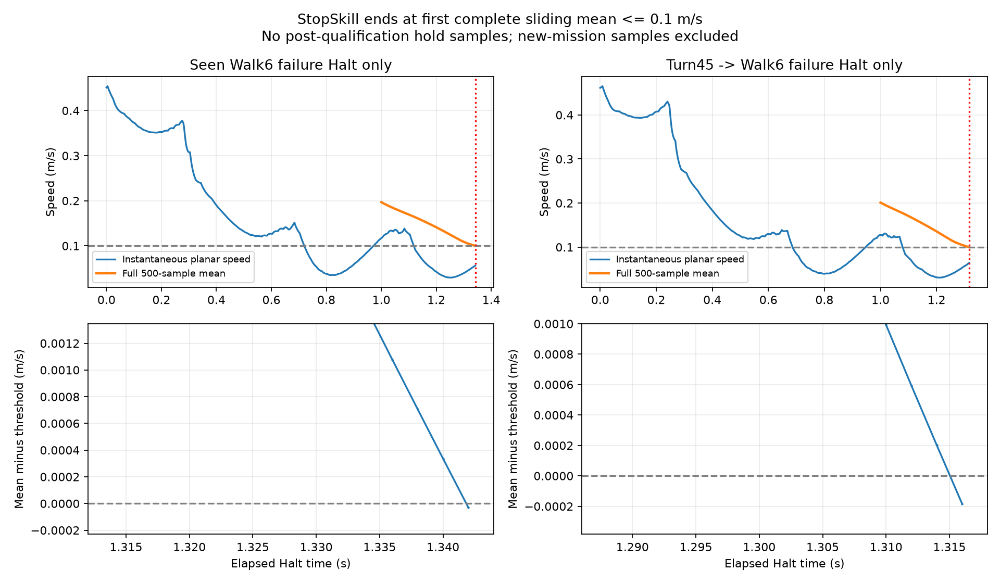

# M2.4 失败覆盖机制：冻结轨迹只读分析

**M2.4 科学结论保持 INCONCLUSIVE，原完整性审计保持 PASS。** 已有轨迹支持：Turn45 后的 Walk 在不同物理状态下接受同样的控制器 reset，较早形成更负的相对航向，随后前向运动的航向投影放大侧向误差；固定 +Y 侧推在可比前缀之后造成正向侧移和后续航向变化，抵消了无侧推条件下的负漂移。两个解释是已有运动轨迹支持的机制描述，不足以把关节状态、reset、接触动力学和 policy 内部响应的因果作用分开。

## 证据和边界

开始时远端 `main=02f2bca`；PR #10 为 Ready for Review、未合并，HEAD `8d80b7a5c24020a4f4664beb6158aad299bfa7f1`。本分析在该 HEAD 的独立工作树中新增，未修改 PR #10。Research Ops CURRENT、38/38 锚点，仍选择 M2.3b；旧的 design-only 文案不被解释成最新批准或科学采纳，指针未更新。

输入是封存的 178 个原始文件，全部重新核对 SHA256 和长度；原始清单 SHA256 为 `6c242d1b3949d5016845d0ecdc3de8b6c10c7e58b36f9e46c5076ad800046d14`。完整输入清单位于相邻冻结 analysis namespace；本分析 `derived/metrics.json` 绑定其哈希、实际使用的原始路径、源码 Git blob / 本地字节哈希、分析程序及 CSV/PNG 哈希。`halt_analysis.json` 另绑定四个 parent_result 原始文件。

只使用三个状态的 parent Walk，以及 seen/transition 的 parent failure-Halt；授权与拒绝两臂的 predecision 轨迹逐字节相同，因此配对副本不作为额外独立样本。新任务的 Walk、Turn、Stop 轨迹均不进入本分析。没有导入或调用 simulator、policy 或 provider；没有新 physics、补采或阈值修改。

## Walk 入口与 reset：相同操作，不同物理状态

| Walk 入口量 | Seen / push | Turn45→Walk6 |
|---|---:|---:|
| 全局时刻 s | 0 | 2.244 |
| 位置 z m | 0.793000 | 0.777414 |
| 实际 yaw deg | 0 | 45.434534 |
| 自身入口坐标系前向速度 m/s | 0 | 0.010427 |
| 自身入口坐标系侧向速度 m/s | 0 | 0.037383 |
| 首个 Walk native 记录 controller counter | 1 | 1 |
| 首个 Walk native 记录 action | 全 0 | 全 0 |
| 首个 Walk native 记录 target | 同一 default angles | 同一 default angles |

Turn 结束和 Walk 开始在同一物理时刻、位置、速度下衔接；入口不是把初始机器人旋转 45° 的副本。相对初始零关节状态，其关节角最大差为 0.694300 rad，关节速度最大差为 0.474437 rad/s。Walk reset 将 action/target/counter 重新初始化，既不把关节变成默认角，也不消除速度。用已保存的入口关节位置/速度及冻结 kp/kd 重算第一步 PD torque，与实际 ctrl 完全一致；Turn 后与 Seen 第一步 torque 最大差 104.404234 Nm。这是同一 reset 目标作用在不同状态上的可观察结果，不是新的 controller 参数。

源码 `basic.py:244–253`、`g1_locomotion.py:103–111`、`live_session.py:247–260` 支持上述顺序。Turn 末 counter=1122，首个 Walk native 记录为 1，action 已清零。policy `reset_memory` 仅在方法存在时被调用；隐藏内部状态未录制，不能声称已检查 LSTM 字节。也没有同一物理入口下的 reset-off 对照，无法确定“reset 本身导致了多少恶化”。无独立接触/足底力记录，不能把身体侧向速度直接称为脚底滑移。

严格评价采用每个 Walk 的**实际入口位置和 yaw**。因此转向后的绝对 yaw 45.434534° 不是 Walk 的 45° 航向误差；下一 Walk 从该方向建立自己的零误差参考。此前世界坐标位移也不计入下一 Walk 的累计侧向误差。三组 parent Walk 都是 open_loop，correction RMS=0。

## 累计误差如何形成

令 δ 为当前 yaw 相对本 Walk 入口 yaw，u、v 为世界平面速度在当前 yaw 方向上的前向/侧向分量。逐 native step 验证：

`d(lateral)/dt = u·sin(δ) + v·cos(δ)`。

使用每步实际 dt、保存的 post-step 速度作右端求和；两项之和与位置差的最大闭合误差小于 `1.6e-13 m`。这是同一速度的坐标分解，不是两个可独立干预的原因，更不是“去掉某项”的反事实模拟。

| 各自 Walk endpoint | Seen | Turn45→Walk6 | +Y 60N push |
|---|---:|---:|---:|
| Walk 持续 s | 12.936 | 12.972 | 12.876 |
| 侧向位移 m | -0.548649 | -0.805182 | +0.203459 |
| 航向偏差 deg | -9.479121 | -11.707249 | -4.396770 |
| 前向运动×航向投影累计 m | -0.587301 | -0.816962 | -0.114558 |
| 身体侧向投影累计 m | +0.038651 | +0.011780 | +0.318018 |
| 原 strict endpoint | FAIL | FAIL | PASS |

Turn 条件在 Walk 1s 已为 -4.523948° / -0.035046m，Seen 为 -1.734696° / +0.004990m。到 2s，航向差约 -2.18°；4、6、8、10s 的两条航向曲线仍约差 -2.1°。身体侧向速度的早期瞬态不同，随后振荡形态接近；更负的航向使前向运动持续累积负侧移。

在**同一 elapsed 12.936s**，Turn 比 Seen 多 -0.253420m 侧移，其中航向投影差 -0.226326m，身体侧向投影差 -0.027093m。按各自第一次通过 6m 的 endpoint 比较，总差 -0.256533m，两项分别 -0.229661m、-0.026872m。2m/4m/6m 首次通过的对照均在 JSON 中，避免仅用不同终止时间解释差异。该结果支持“更负的航向投影占主要累计差异”；无法区分入口关节、速度、姿态与 reset 交互中哪个因素产生了早期航向偏差。





## 侧推是否抵消原漂移：先确认前缀

Seen 和 push 的初始保存状态完全相同；从第一个 native step 到 t=1.000s，**500 行**的 time、qpos、qvel、ctrl、controller action/target/counter、xfrc_applied 全部精确相同。第一个差异在 post-step t=1.002s；100 个施力区间对应 pre-step 1.000–1.198s，post-step 1.002–1.200s，随后清除。隐藏 policy/RNG/接触求解器状态未独立保存；观测前缀和冻结执行配置支持此单一确定性配对，但不扩展为随机重复或外推可靠性。

不能简单说“施力前机器人已在负侧”。t=1s 的侧向**位置**仍为 +4.990mm，但身体侧向速度为 -0.014374m/s、相对 yaw 为 -1.734696°。无侧推轨迹随后转为负漂移；+Y 干预反向改变了该后续趋势：

| 共同 Walk 时间 | Seen 侧移 m | Push 侧移 m | Push−Seen m |
|---|---:|---:|---:|
| 1.0s，施力开始前 | +0.004990 | +0.004990 | 0 |
| 1.2s，施力窗口结束 | -0.008514 | +0.038094 | +0.046609 |
| 2.0s | -0.020328 | +0.264493 | +0.284820 |
| 4.0s | -0.067600 | +0.311955 | +0.379555 |
| 10.0s | -0.351937 | +0.280182 | +0.632119 |

窗口结束时的差异几乎来自身体侧向投影：+0.046541m，而航向投影差仅 +0.000068m。到 2s，身体侧向投影差约 +0.272350m，之后保持约 +0.28m；航向在推后改变，4s 为 +1.797460°，Seen 为 -3.203966°。后续较少的负航向投影使差异继续增大。共同终止前 t=12.876s 的总差 +0.750858m，由航向投影差 +0.468459m、身体侧向投影差 +0.282399m 组成。

因此 **“该固定 push 抵消已有负漂移”得到配对轨迹支持**，且不仅是瞬时平移；后续航向也改变。不能把 +0.318018m 全部归为 0.2s 外力的直接机械位移，控制器、接触与惯性响应同样在该项里；缺少力分解和独立干预，无法给出冲量与 policy 的因果份额。

push 的侧移峰值为 **0.334887m**，大于 0.21m；但冻结 strict 规则检查的是 Walk **endpoint**，没有把沿途最大侧移作为拒绝项。终点 +0.203459m，距边界仅 0.006541m；航向绝对值 4.396770° 也在 8° 内，距离/时间条件通过。因此 Runtime 正确记录 NO_HALT_TRIGGER，而不是强制制造失败。这里没有 push 后的失败→Halt→重新执行样本，也不能据此推荐侧推作 recovery。



## Halt：极小裕量来自首次过阈选择

StopSkill 不 reset 控制器，继续在实际失败状态下发零速度 command。它逐 native step 收集**500 个 post-step 平面速度**，第一个完整窗口均值 ≤0.1m/s 时立即结束；监测器额外保存的 pre-Halt 行不进入均值。最早可能结束在 1s，500 个样本首尾时间跨度为 0.998s。Runtime 随后另外检查瞬时速度、位移、时长、finite/standing/no-fall。

| Parent failure-Halt | Seen | Turn45 后 |
|---|---:|---:|
| 首次合格步 / 时长 | 671 / 1.342s | 658 / 1.316s |
| 前一窗口均速 m/s | 0.100336637365 | 0.100201129930 |
| 最终窗口均速 m/s | 0.099969581517 | 0.099816057322 |
| 均速通过裕量 m/s | 0.000030418483 | 0.000183942678 |
| 最终瞬时速度 m/s | 0.056035226012 | 0.063989911782 |
| 最终 500 样本中瞬时速度 >0.1 的数量 | 262 | 251 |
| 合格后继续保持的 Halt 样本 | 0 | 0 |

所有更早的完整窗口均不合格。滑动窗口关系 `mean[k]−mean[k−1]=(v_new−v_removed)/500` 解释了从刚高于阈值到刚低于阈值的一步跨越；这里的微小裕量与“第一次通过就终止”的终点选择直接相关，不能当成独立的持续低速余量。均值条件也不要求窗口内每一瞬时值低于阈值。两条轨迹仍真实通过原 HALT_SUCCEEDED 判据，本分析不把它改判失败。

**没有 post-qualification hold 证据。** 随后的新任务改变了 command，拒绝臂的一次 stale-state tick 也不是持续保持协议；两者都不用于推断保持稳定。图严格在 parent Halt 终点截断。



## 能区分与不能区分的解释

| 解释 | 证据判断 |
|---|---|
| Turn 的恶化只是把世界 y 当本地侧向 | 不支持；重建实际入口 frame 后差异仍存在 |
| Turn 后 reset 清除了物理状态 | 不支持；关节/速度连续，reset 只作用控制器状态 |
| Turn 更多负侧移主要体现为航向投影累计 | 支持；同时间、同进度对照和数值闭合一致 |
| 主要原因一定是 reset / 某个关节 / 残留转动 | 无法区分；这些没有独立对照，隐藏记忆和接触状态不完整 |
| push 前对照已不一致 | 保存字段不支持；施力前 500 行精确相同 |
| 固定 +Y 推力抵消了该轨迹的负漂移 | 支持此确定性配对；不代表通用 recovery 或更强扰动单调更坏 |
| push 全程在 strict corridor 内 | 不支持；只有终点规则通过，沿途峰值越过 0.21m |
| Halt 极小裕量证明持续稳定保持 | 不支持；首次完整均值过阈即停止，没有独立保持段 |

## 复算、审查和停止

使用冻结依赖环境，仅 NumPy / PyYAML / Matplotlib 和标准库处理文件。若原始数据尚未恢复，先在源 checkout 使用相邻 `archive_evidence.py --restore-to EMPTY_ROOT`，再执行：

```powershell
& $Python experiments/m2/failure_coverage_mechanism_001/analyze.py --raw-root $RestoredRoot --output $NewOutput
& $Python experiments/m2/failure_coverage_mechanism_001/halt_analysis.py --rawroot "$RestoredRoot/experiments/m2/cross_state_reliability_001/artifacts" --output $NewHaltJson
```

CSV 保存每个 native 时间点的坐标、速度、累计项和数值闭合残差。对子代理独立审查暴露的 target 检查命名问题，已补上默认 target 的实际断言；未改输入。独立复算确认分解结果误差 ≤1.17e-15m、500 行前缀、100 个施力区间、Halt 单独瞬时判据和全部首次均值跨越。复算回执、不可变证据检查和图像检查另存于本 namespace。

已具备回答本轮只读问题的证据，分析在此停止。下一轮若另行批准，应先设计能够分开以下因素的最小对照：同一实际入口状态下的控制器历史/reset；固定推力相对于无扰动预测漂移的方向与时机，而非按结果搜索 severity；独立预声明的零 command 保持段，将首次停止与持续保持分开记录。任何新状态必须先冻结可达构造、缺失覆盖处理和预算；不得从本分析自动启动。当前缺少的 reset 对照、push 失败链路、接触力机制和 Halt 保持证据均保持缺失。
