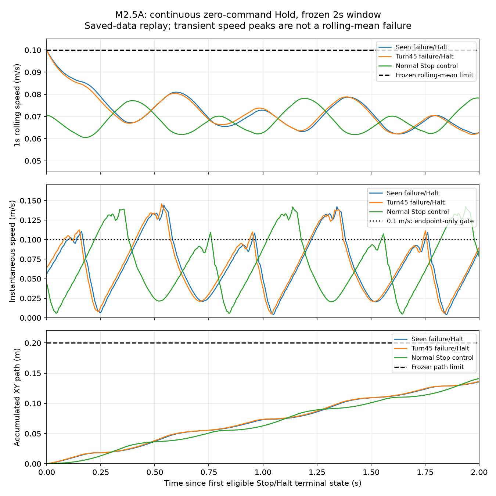

# M2.5A Post-Halt Hold Qualification — scientific candidate

**Candidate: `PASS_BOUNDED_POST_HALT_HOLD_IN_TWO_SEEN_SEED0_STATES_WITH_NORMAL_STOP_CONTROL`.**
One authorized campaign completed all three frozen cells exactly once. Both
seen seed-0 failure/Halt states and the normal Stop measurement control met
the complete prospective 2.000 s Hold contract. This is evidence submitted in
an independent **Draft** PR, not accepted-main publication, a Research Ops
selection change, task recovery success, or production/hardware safety.
M2.4 remains **`INCONCLUSIVE`**.

## Authorization, execution identity and budget

The [Owner authorization](https://github.com/Anhao1314/g1-jev-swarm-lab/pull/14#issuecomment-6076429877)
is retained in [owner_authorization.json](owner_authorization.json).
Execution used the unchanged isolated PR #14 checkout at
`d7fcb76b1acabd166f9c279d75e4a6a53783e979`; it was not rebased onto the
advanced ROS main. Readiness SHA-256 is
`6e51d067cd32717f33e1d253d41d9a8430ceaecd2cabb324cda95ae468947802`.
The immutable protocol's pre-authorization `physics_authorized=false` field
was preserved; the explicit Owner authorization and CLI flag authorized only
this bounded invocation.

Immediate [target preflight](logs/target_preflight.log) and
[execution gate](logs/readiness_gate.log) passed before physics: 241 inherited
sources, 254 execution sources, 91 official assets, 41 dependency versions,
28 XML resource links and checkout import origins matched. The same 254
source hashes matched after execution, and the execution checkout stayed
clean at the exact frozen commit. [execution_receipt.json](execution_receipt.json)
binds the protocol, readiness, authorization snapshot, environment and logs.

Frozen order and measured steps:

| Cell | Parent + Hold native steps | Frozen cell cap | Attempts |
| --- | ---: | ---: | ---: |
| Seen failure/Halt | 7,139 + 1,000 = 8,139 | 10,000 | 1 |
| Turn45 failure/Halt | 8,266 + 1,000 = 9,266 | 12,000 | 1 |
| Normal Stop control | 5,991 + 1,000 = 6,991 | 8,000 | 1 |

Total **24,396 / 30,000 native steps**. Research Ops measured the entire
sequential acquisition command at **32.5378347 s**, below 360 s. Because
this interval contains every cell, it also conservatively bounds each cell
below 120 s; the frozen per-cell guards and external watchdog were active.
Exact per-cell elapsed times were not persisted, so no cell-latency estimate
is reported. No retry, replacement state, extra cell or budget stop occurred.

## Physical results under the unchanged contract

All cells continued the same simulator/controller/policy objects directly
from eligible Stop/Halt termination for exactly 1,000 × 0.002 s. There was no
extra reset, new session, task-node dispatch or new Mission during Hold.
Every Hold command was exactly `(0,0,0)`; terminal and pre-first-step states,
object identities and controller counters remained continuous. Historical
parent native prefixes matched the sealed M2.4 traces exactly. The original
strict failures remain failures and are not rewritten by the Hold result.

| Cell | Max 1 s rolling mean (m/s) | Final speed (m/s) | XY path (m) | Hold result |
| --- | ---: | ---: | ---: | --- |
| Seen failure/Halt | 0.099604884 | 0.086390810 | 0.135574498 | Bounded PASS |
| Turn45 failure/Halt | 0.099437391 | 0.090219608 | 0.136287493 | Bounded PASS |
| Normal Stop control | 0.078349090 | 0.077928123 | 0.141010946 | Bounded PASS |

All **3 × 1,000 rolling windows** met ≤0.1 m/s, all terminal speeds met
≤0.1 m/s, all XY paths met ≤0.20 m, and all sampled states were finite,
standing and without a fall. Minimum base heights were 0.773152 / 0.773013 /
0.773250 m; maximum tilts were 3.80190 / 3.80396 / 3.74139 degrees.
There were no physical failures, technical partials, missing cells or
integrity/budget interruptions in this actual campaign. These classes were
not merged or replaced with PASS; none occurred in the retained data.

The first qualifying Stop windows occurred at Stop steps 671 / 658 / 500,
with means 0.099969582 / 0.099816057 / 0.070636282 m/s. The failure-state
crossing margins were very small (0.000030418 / 0.000183943 m/s), yet every
subsequent frozen Hold rolling window remained within the bound. The first
Hold rolling window incorporates 499 prior Stop speeds plus one Hold speed;
all later windows are audited with that exact initialization.

**Bounded Hold is not immobility.** Instantaneous speed peaks were
0.144113 / 0.145732 / 0.142378 m/s, above 0.1 m/s. The frozen criterion is
rolling mean plus final instantaneous speed, not an every-step instantaneous
speed limit. Net XY displacement was 0.030440 / 0.031100 / 0.066692 m,
while accumulated path was 0.136–0.141 m. No smoothness, zero-displacement,
or physically motionless claim follows.



The [CSV](derived/hold_timeseries.csv), [summary](derived/summary.json) and
[output manifest](derived/output_manifest.json) bind this figure to raw and
audit hashes. It depicts saved measurements, not another simulator execution.

## Independent audit, sealing and reproduction

The unchanged frozen [audit.py](../post_halt_hold_design_001/audit.py)
returned **`AUDIT_PASS_RECORDED_RESULTS`**. Its exact
[stdout](logs/frozen_audit_stdout.log) and parsed [audit.json](audit.json)
recompute first crossing, all rolling means, path, final speed, physical
flags, parent result/prefix, graph and continuity/budget witnesses. The
separate [independent audit](independent_audit.md) and
[second implementation](independent_recompute.py) directly recompute
speed from native qvel, XY path from native qpos, posture from quaternion,
first crossing, source hashes, parent archive/member bindings and continuity.
All checks passed without physics, policy, provider or acquisition calls.

All **43 original files / 64,962,438 bytes** are losslessly retained in
[raw/campaign_001.zip](raw/campaign_001.zip), SHA-256
`780164d135b87975be8034fa6bc9db6ef8534f0041e9e41ef03a4494dfca876a`.
The [raw manifest](raw_manifest.json) seals each original file and ZIP.
It includes full native/hold journals, parent artifacts, first Stop/entry
snapshots, outcomes, controller/policy/reset witnesses, worker logs and the
campaign receipt. No original campaign file was edited during sealing.

The archive was restored into a clean temporary directory and every member
rehash matched. Running the frozen auditor against that restoration produced
the **same exact stdout SHA-256** as against the original:
`900da5f6e5bdf1ccca9c2414088605e98a2e6414608a5b541cbebe490a0c8458`.
The new restoration helper passed **11/11 offline tests**, including the
real 43-file restoration, tamper/path/duplicate/symlink and overwrite refusal.
The retained frozen 97-test readiness suite was reused through unchanged
source/dependency bindings; it was not rerun as a new physical experiment.

From a byte-preserving checkout of this evidence branch, restore to a new
directory and use the original, prepared d7fcb76 execution checkout as source:

```powershell
$py = 'D:/work/g1-jev-swarm-lab/.venv/Scripts/python.exe'
New-Item -ItemType Directory -Path '<fresh-dir>' | Out-Null
& $py experiments/m2/post_halt_hold_qualification_001/restore_raw.py --output '<fresh-dir>/campaign_001'
$env:PYTHONPATH = '<d7fcb76-checkout>/src;<d7fcb76-checkout>'
& $py '<d7fcb76-checkout>/experiments/m2/post_halt_hold_design_001/audit.py' '<fresh-dir>/campaign_001' --readiness-sha256 6e51d067cd32717f33e1d253d41d9a8430ceaecd2cabb324cda95ae468947802
& $py experiments/m2/post_halt_hold_qualification_001/independent_recompute.py --source-root '<d7fcb76-checkout>' --evidence-root '<fresh-dir>'
& $py experiments/m2/post_halt_hold_qualification_001/analyze_saved.py --campaign '<fresh-dir>/campaign_001' --output '<fresh-derived-dir>'
```

These commands restore and audit existing bytes, never call `acquire`, and
require fresh output directories. The frozen auditor verifies source/assets
and pinned manifest bindings; the retained target preflight separately checks
installed dependency versions. Prepare that target using PR #14's existing
no-physics restoration instructions rather than bypassing its checks. The
independent recomputation writes only a derived JSON outside `campaign_001`.

## Telemetry, limitations and stop

Research Ops measured one acquisition command (32.5378 s), four nonphysical
preflight/audit commands (12.4765 s total), and the final restoration test
command (0.7891 s). Logs and a separate telemetry receipt are retained.
Reasoning/implementation/independent-audit intervals and tokens are not fully
measured; unavailable values are not invented or reported as zero.

Only two previously seen, deterministic seed-0 failure states and one
non-matched normal Stop control were sampled, for 2 seconds. The study does
not establish independently sampled reliability, longer holding, hardware
safety, production authority, task restart qualification or Jev eligibility.
Hidden recurrent policy bytes were not snapshotted; same-object/no-reset
witnesses cannot prove hidden-memory byte equality. Recorded state journals
and exact parent-prefix reproduction are evidence, not an independent
physics engine or a new observer-on/off Hold experiment.

The authorized fixed campaign is complete and the bounded question is
answerable. Preserve this candidate in a Draft dependent evidence PR, retain
PR #14's frozen HEAD and all old scientific decisions, and stop. No merge,
baseline promotion, ROS-R2, new physics, policy/provider campaign, training,
Jev, Multi-Swarm or hardware operation follows from this result.
